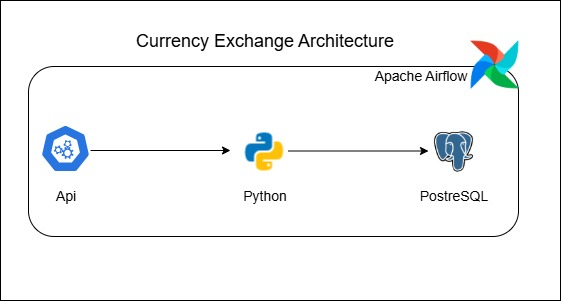

# Carbon Intensity ETL
This project leverages on the orchestrating power of airflow to seemlessly extract data from an Api at scheduled intervals

#Business Case (Xtd Research labs)
Xtd Research Labs is dedicated to pushing the boundaries of scientific knowledge and making a positive impact on the world. Through our research, collaborations, and community engagement, they strive to create a healthier, more sustainable future for all.

# Problem Statement
Xtd Research Labs has successfully built a data pipeline to ingest and process historical carbon intensity data for the United Kingdom, enabling analysis of trends and patterns in electricity generation. However, the pipeline currently relies on manual triggers and interventions, resulting in inefficiencies, potential errors, and delayed insights. This manual operation hinders the lab's ability to conduct timely and continuous research on the environmental impact of energy sources.

## Rationale for the Project
Automating the existing data pipeline will dramatically improve the efficiency, reliability, and scalability of Xtd Research Labs' environmental impact research. By eliminating manual data handling, the lab can minimize errors, accelerate data processing, and enable more frequent and comprehensive analyses.

## Aim of the Project
  * Develop a system to automatically retrieve historical carbon intensity data from the Carbon Intensity API.
  * Store the data in a structured format for analysis and reporting.
  * Automate the existing data pipeline for historical carbon intensity data in the UK
  * Implement robust error handling, monitoring, and logging mechanisms.

## Tech Stack
  * Request Library
  * Pandas Library
  * Postgres
  * Python
  * Airflow

## Project architecture

## Project Workflow
  * Data Extraction: Used Python codes to extract historical carbon intensity data from https://api.carbonintensity.org.uk/intensity.
  * Data Transformation: Used pandas to parse and manipulate the data for storage compatibility.
  * Data Storage: Designed a database schema to organize the data effectively and store with help of sql queries.
